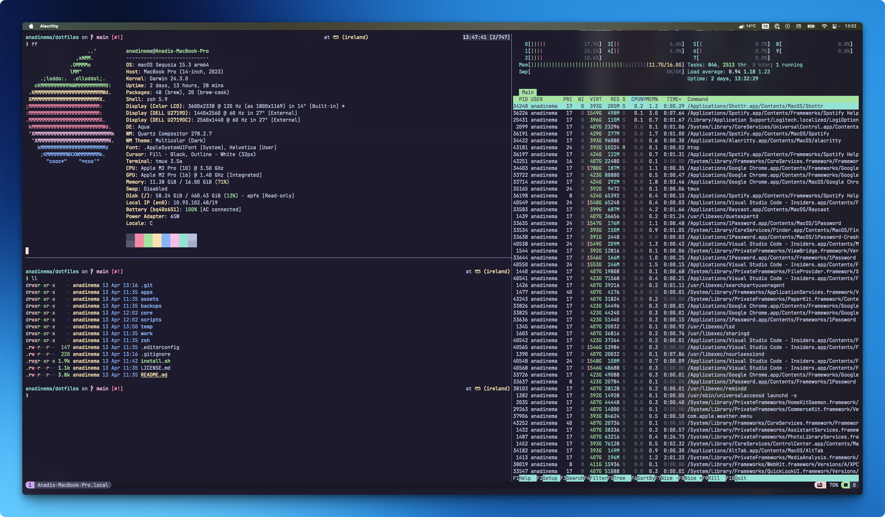

# Dotfiles - Dotting the mac :)

<hr />

## Installation

**Note:** If you want to give these dotfiles a try, you should first fork this repository, review the code, and remove things you don’t want or need. Don’t blindly use the settings unless you know what that entails. Use at your own risk!

### Pre-requisites

You should have the following tools installed to follow further steps:
* Git
* ZSH

If you don't have these tools (starting with a new mac let's say), then use the following command to get the pre-requisites setted up.

```zsh
xcode-select --install
```

Then follow the prompts till the installation is complete.

Check if git is installed by running `git --version`. It should spit out some version (not concerned about what version it is because we will install git later from brew).

Run `echo $0`. If it didn't spit out **-zsh**, then use run `chsh -s $(which zsh)` to change your shell to zsh (assuming you have zsh installed already).

Once shell is changed restart your terminal.

### Using Git and the install script

You can clone the repository wherever you want. (I keep it in `~/dotfiles`).

The below command will get the repository and place it in `dotfiles` folder inside you user home directory and export that directory path.

```zsh
git clone https://github.com/anadinema/dotfiles.git $HOME/dotfiles && cd $HOME/dotfiles && export DOTFILES=$(pwd)
```

Then to start the setup, run:

```zsh
./install.sh
```

By default, it will not run the `defaults` script which set some sensible macos defaults. In case you want to run it, then add the **RUN_DEFAULTS** variable as `1` and run:

```zsh
RUN_DEFAULTS=1 ./install.sh
```

Some of the functionality of these dotfiles depends on formulae present in `brew/Brewfile`. If you plan to not install `brew` or it's formulae, you should look carefully through the script and manually install any particularly important ones. A good example is stow: the GNU utility to manage the symlinks for the dotfiles.

## Feedback

Suggestions/improvements
[welcome](https://github.com/anadinema/dotfiles/issues)!

## Author

### Anadi Nema - Connect & support me on

<a href="http://github.com/anadinema" target="_blank"></a>
<a href="http://linkedin.com/in/nemaanadi" target="_blank"></a>
<a href="https://stackoverflow.com/users/23308314/anadinema" target="_blank"></a>
<a href="https://www.buymeacoffee.com/anadinema" target="_blank"></a>

#

<div align="center">

### Show some ❤️ by starring some of the repositories!

</div>

## Thanks and credits to

* [Mathias Bynens](https://mathiasbynens.be/) and his [dotfiles repository](https://github.com/mathiasbynens/dotfiles)
* [Gianni Chiappetta](https://butt.zone/) for inspiring [ lot of dotfiles](https://github.com/gf3/dotfiles)
* [Kevin Suttle](http://kevinsuttle.com/) for sharing [lots of macos defaults](https://github.com/kevinSuttle/macOS-Defaults)
* [Matijs Brinkhuis](https://matijs.brinkhu.is/) and his [dotfiles repository](https://github.com/matijs/dotfiles)
* Anyone who (already have or will) [contributed a patch](https://github.com/anadinema/dotfiles/contributors) or [made a helpful suggestion](https://github.com/anadinema/dotfiles/issues)
